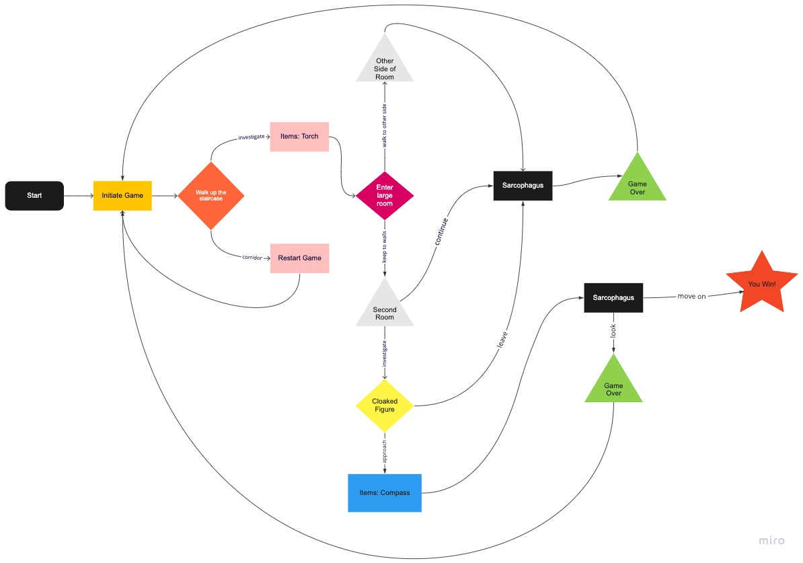
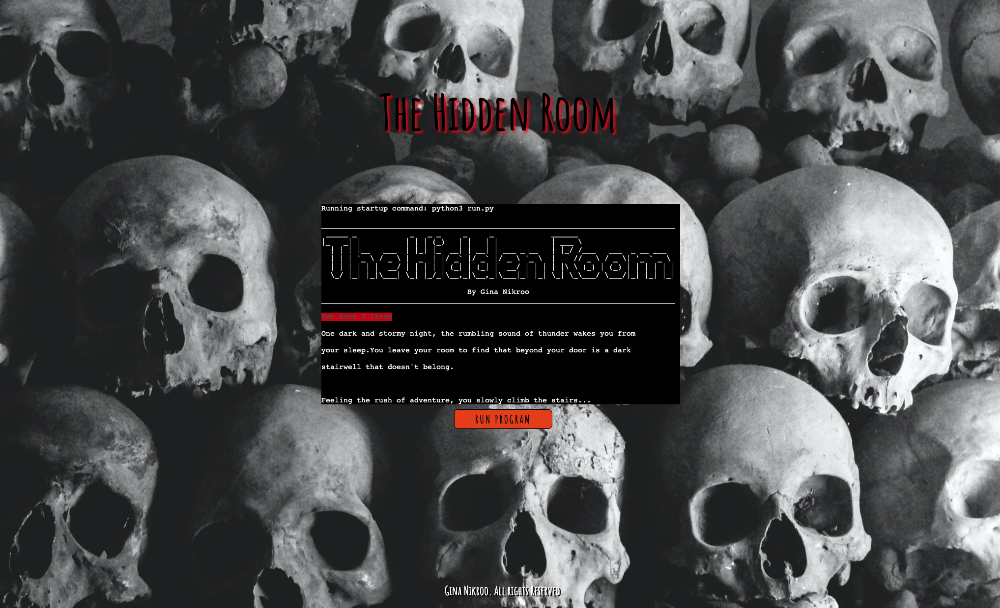
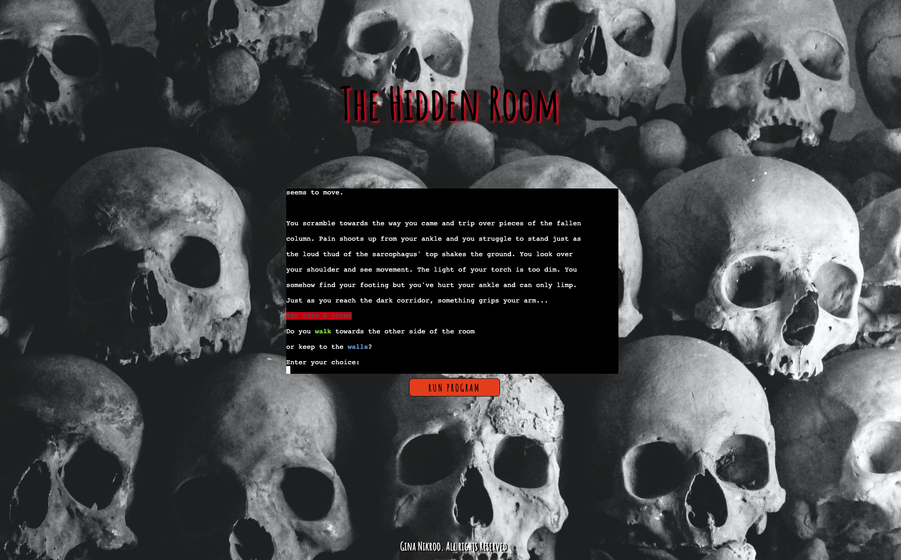
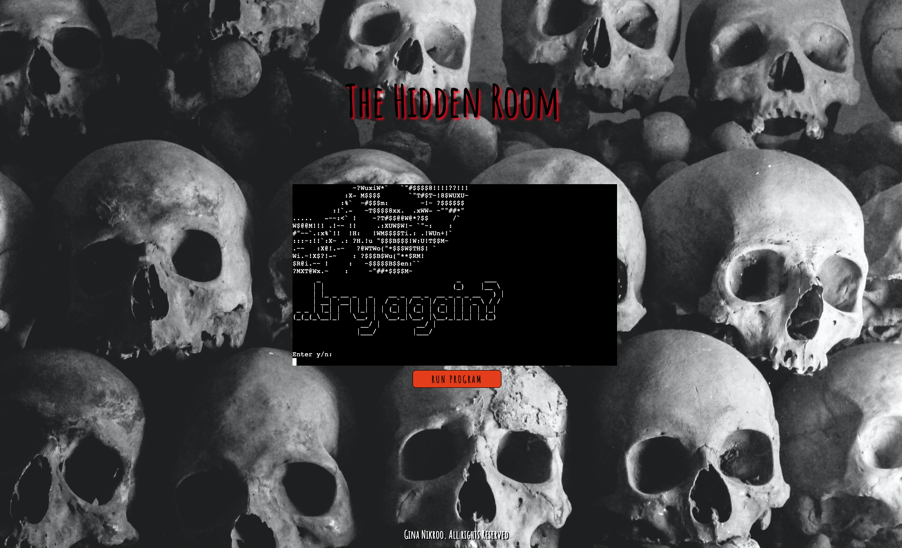
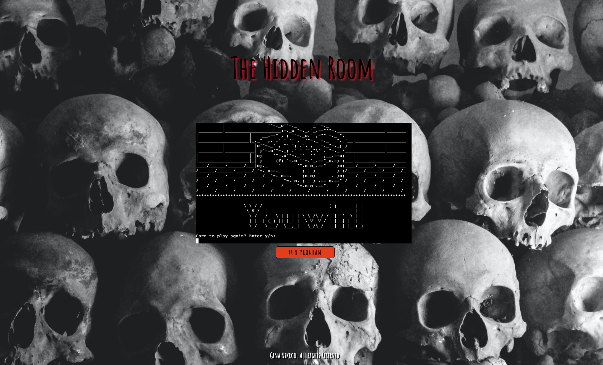

# The Hidden Room 

  

The Hidden Room is a classic text-based adventure played by typing in one of two presented choices in an attempt to reach the winning choice. I wanted to create a project that was nostalgic and took advantage of the limitations presented by using the Code Institute template (inability to use graphical libraries). 

  

The live website can be found on [Heroku](https://the-hidden-room.herokuapp.com/). 

  

To open links in a new browser tab, press CTRL + Click.  

  

## Table of Contents 

* [User Experience Design (UX)](#ux) 

  

  * [Strategy](#strategy) 

   

    * [Site Functionality](#site-functionality) 

  

  * [Scope](#scope) 

  

    * [Features](#features)  

  

  * [Structure](#structure) 

  

  * [Skeleton](#skeleton) 

  

  * [Surface](#surface) 

  

    * [Gameplay](#gameplay) 

  

    * [Game End](#game-end) 

     

* [Testing Strategy](#testing-strategy)  

  

  * [Validator Testing](#validator-testing)  

  

  * [Bugs](#bugs)  

  

* [Deployment](#deployment)  

  

* [Credits](#credits)  

  

* [Media](#media)  

   

## UX 

  

### Strategy 

* As a casual gamer, I want to play a simple game to pass the time 

* As a gamer, I enjoy nostalgic game styles 

* As a serious gamer, I enjoy unpredictability  

  

#### Site Functionality 

The goal of the site is to provide an easy to play game with an engaging design. Players begin with a set number of lives and navigate through the adventure without knowing what will happen after each choice. The site employs nostalgic use of ASCII images and is a throwback to the text-based adventures made popular in the early days of the console. 

  

### Scope 

#### Features  

* Responsive design across a small range of monitor sizes.  

* Lives are regenerated upon game end. 

* Accepts user input. 

  * Validates user input by requiring the input to be one of two choices offered. 

* Keeps track of lives remaining. 

* Data maintained in class instances. 

 

  

### Structure 

User Stories: Acceptance Criteria: Implementation 

> As a casual gamer, I want to play a simple game to pass the time 

* Acceptance Criteria:  

  * The game should be straight forward with simple instructions. 

* Implementation: 

  * The user is instructed to type the exact input needed to move the game forward and keeps track of the players lives. 

> As a gamer, I enjoy nostalgic game styles 

* Acceptance Criteria: 

  * The design should be familiar. 

* Implementation: 

  * Taking advantage of the limitations of the python template for this particular project, instead of utilizing graphical libraries to create a modern game I used ASCII images for a nostalgic throwback to older console games. 

> As a serious gamer, I enjoy unpredictability 

* Acceptance Criteria: 

  * The game should present choices that lead to different outcomes which provides a sense of surprise. 

* Implementation: 

  * The game presents several scenes, each with one or more choices which influence the outcome of the game. The player must navigate these choices to win. 

  

### Skeleton 

#### Game Flowchart 

 

  

### Surface 

The game was designed to provide a fun, time wasting game that provides an air of nostalgia. It is simple yet unpredictable.  

 

  

#### GAMEPLAY 

The game begins upon opening the page. The user moves the gameplay forward by entering one of two choices.  

The user can lose lives by making the wrong choice. They are then prompted to make another choice. 

 

  

#### GAME END 

The game is over either when the player loses or wins. 

The player is given 3 tries (lives) before a game over script appears and they are then given the choice to begin again or exit the game.  

 

 

Once the player inputs the correct sequence of choices to reach the end of the script, the game is won. 

 

  

## Testing 

* The game works in different browser: Chrome, Firefox, Safari 

* It is responsive and has a cohesive look. 

* The game and terminal work in both macOS and Windows. 

* The code has been passed through PEP8 linter. 

* Tested both in local terminal and in Heroku terminal 

* Given invalid inputs: 

  * Numbers 
  * Left empty 

  * Invalid strings 

  

### Validator Testing  

* PEP8 

  * No errors were returned from PEP8online.com  

 

### Bugs  

After deployment, the color when stating player lives dropped to the next line: 

* New line code was included in the ANSI escape code for color 

  *Fixed by moving the new line code 

 

## Deployment  

My site was deployed to [Heroku](https://the-hidden-room.herokuapp.com/). I first created my app in heroku. From the terminal, I then retrieved my app from heroku by logging in, getting the app name, setting my heroku to remote and pushing my code.   

* In the terminal, type: 

  *heroku login -i 

  *heroku apps 

  *heroku git:remote –a the-hidden-room 

  *git add. && commit –m "Deploy to Heroku via CLI" 

  *git push origin && git push heroku main 

  

## Credits  

### Media 

* Background image was downloaded and used with permission from [Pexels](https://www.pexels.com/). 

* The ASCII art was copied for free use from [ASCII art](https://ascii.co.uk/).